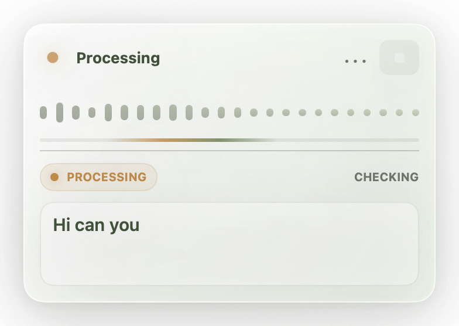
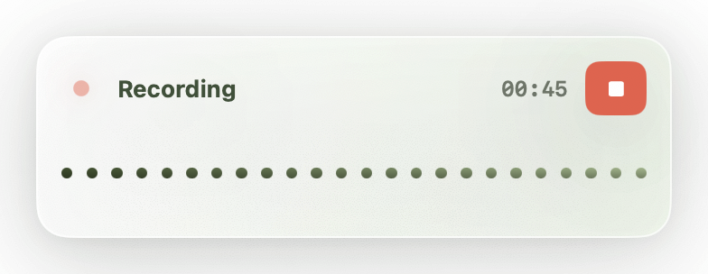
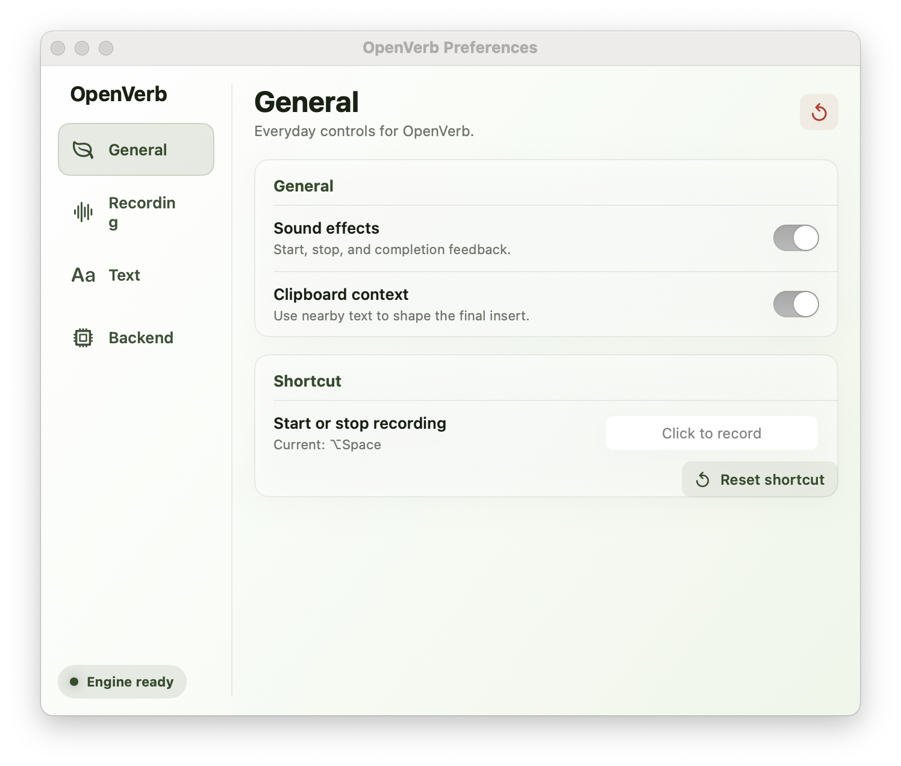

<div align="center">


# OpenVerb

**Press a hotkey, talk, get text — anywhere on macOS, fully offline.**

A menu-bar dictation app that runs Gemma 4 locally and types into whatever app you're focused on. No cloud. No subscription. No telemetry.

[]()
[]()
[](LICENSE)
[]()



</div>

---

## Why

Cloud dictation tools (Superwhisper, Wispr, Whisper Flow) are great until you remember every word you say is a `POST` request. OpenVerb is the boring, paranoid version: the model lives on your laptop, the audio never leaves it, and the only thing that goes over the network is `git pull`.

It's also the version that works on a plane.

## What it does

- **One global hotkey** (`⌥Space` by default) starts recording from any app.
- A small floating HUD shows the live waveform and the partial transcript while you speak.
- Release the hotkey, OpenVerb finishes inference, and pastes the result into the field you were typing in.
- Idle, it sits in the menu bar and uses ~0% CPU.

## Highlights

- **100% on-device.** Gemma 4 E2B (audio + text) runs on the Apple Neural Engine and CPU via `llama.cpp`. Zero network calls at runtime.
- **Context-aware polish.** A second LLM pass cleans the raw transcript with knowledge of the app you're in (Slack vs Xcode vs email) and the surrounding text.
- **Live partial transcription** while you speak — no "wait for the spinner" UX.
- **Engineered for cold start.** Model is mmap'd at launch, KV-cache is pre-warmed, first token after hotkey is sub-second on M-series.
- **Works in everything.** Native AppKit, SwiftUI, Electron, web text inputs, terminal, password fields (yes, with a warning).
- **Open source, MIT.** Build it, fork it, ship your own thing on top of it.

<div align="center">

<br/><br/>

</div>

## Status

**Alpha.** It works, it's stable on my machine, the test suite is green, but I'm still chasing edge cases (see `bugs.md`). API and config formats may shift between alpha tags.

If you find a regression, open an issue with the engine log from `~/Library/Logs/OpenVerb/` — that's the most useful thing you can send.

## Requirements

| | |
|--|--|
| **macOS** | 13.0 Ventura or newer |
| **CPU** | Apple Silicon (M1/M2/M3/M4). Intel Macs are not supported and there are no plans to. |
| **RAM** | 8 GB minimum, 16 GB recommended |
| **Disk** | ~6 GB for the model weights |
| **Permissions** | Microphone, Accessibility (for hotkey + paste), Input Monitoring |

## Install

> **There are no signed builds.** I don't have an Apple Developer account, and even if I did, I'd rather you build the thing yourself than trust a binary from the internet. The installer below does it for you in ~5 minutes.

### Option A — One line (recommended)

```bash
curl -fsSL https://raw.githubusercontent.com/Terobyte/OpenVerb/main/scripts/install.sh | bash
```

That's it. The installer:

1. Clones the repo into `~/.openverb/source` (re-running updates instead of re-cloning).
2. Builds the C++ engine.
3. Downloads the Gemma 4 E2B weights (~5 GB, one-time, resumable).
4. Creates a free, stable, self-signed code-signing identity in your **login keychain** so macOS keeps your Microphone / Accessibility / Input Monitoring grants across rebuilds — **no Apple Developer account, no sudo**.
5. Builds a signed `OpenVerb.app` and copies it to `/Applications`.

Launch it once and grant the three permissions. Default hotkey is `⌥Space`.

> **Why the signing step?** macOS pins permissions to the code-signature hash. Apple's default ad-hoc signing rotates that hash every rebuild, dropping your grants. The installer generates a stable self-signed cert so your grants persist forever — same UX as a paid Developer ID, $99/year cheaper.

> Don't trust `curl | bash`? Read [`scripts/install.sh`](scripts/install.sh) first — it's 90 lines, no obfuscation. Then run it locally:
> ```bash
> git clone --recurse-submodules https://github.com/Terobyte/OpenVerb.git && cd OpenVerb && ./scripts/install.sh
> ```

### Option B — Manual build

If you want to control each step (custom model paths, different signing identity, building only the engine for hacking, etc.) the individual scripts are documented in [`BUILD.md`](BUILD.md).

### Option C — Homebrew Cask (planned)

```bash
brew install --cask openverb
```

Will be a thin wrapper around the installer above. Not yet published — see the issue tracker.

## Usage

| Action | Default shortcut |
|--|--|
| Start / stop dictation | `⌥Space` (hold or toggle) |
| Cancel current recording | `Esc` |
| Open settings | menu bar → ⚙ |

Everything is rebindable in Settings. The model, language, polish prompt, and HUD position are all editable from there too.

## How it works

```
   Mic → AVAudioEngine ─► VAD + ring buffer ─► Engine (C++ subprocess)
                                                         │
                                  llama.cpp + Gemma 4 E2B (audio+text)
                                                         │
            Live partial transcript ◄────── Unix socket ─┤
                                                         │
                              Final transcript ◄─────────┘
                                       │
                       Context builder (focused app, selected text)
                                       │
                       LLM polish pass (same model, text-only)
                                       │
                      Clipboard injection + ⌘V into focused field
```

The engine runs as a separate, sandboxed C++ process. The Swift app talks to it over a Unix-domain socket using length-prefixed JSON. This means a model crash never takes the UI with it, and you can swap engines without touching the app.

More detail in [`docs/architecture/`](docs/architecture/).

## Privacy

- No network calls. Block OpenVerb at the firewall and it works exactly the same.
- No analytics, crash reporters, or "anonymous usage stats."
- Audio buffers are held in memory only and zeroed when a session ends.
- Transcripts are not persisted to disk unless you turn that on in Settings.

There is one exception: when you click "Check for updates" the app fetches the latest release tag from this repo's GitHub API. That's it.

## Roadmap

- [x] Core recording → transcribe → paste loop
- [x] Live partial transcription
- [x] Context-aware polish pass
- [ ] Multi-language UI (engine is already multilingual)
- [ ] Custom vocabulary / glossary support
- [ ] Whisper-compatible CLI (`openverb < input.wav`)
- [ ] Plugin API for post-processing (translate, summarize, etc.)

## Contributing

Issues and PRs welcome. Before you spend a weekend on a big change, please open a discussion — I want to keep the surface area small.

```bash
cd app && swift test               # Swift unit + integration tests
./scripts/ov_smoke.sh              # end-to-end smoke against fixture audio
```

## Acknowledgements

OpenVerb stands on the shoulders of:

- [`llama.cpp`](https://github.com/ggml-org/llama.cpp) — the C++ inference engine.
- [Google Gemma](https://blog.google/technology/developers/gemma-3/) — the audio + text model family.
- [Silero VAD](https://github.com/snakers4/silero-vad) — voice activity detection.

If any of those go away, OpenVerb goes with them. Sponsor them.

## License

MIT. See [`LICENSE`](LICENSE).
